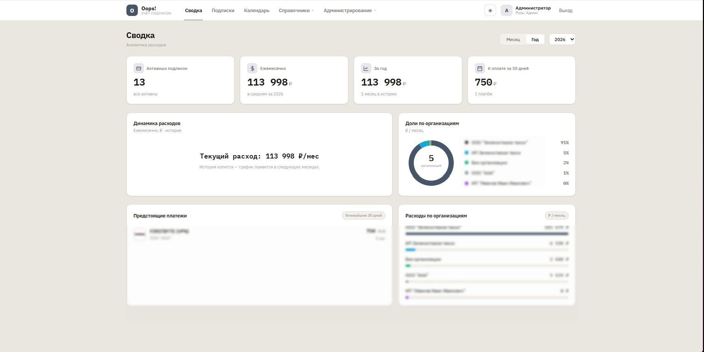
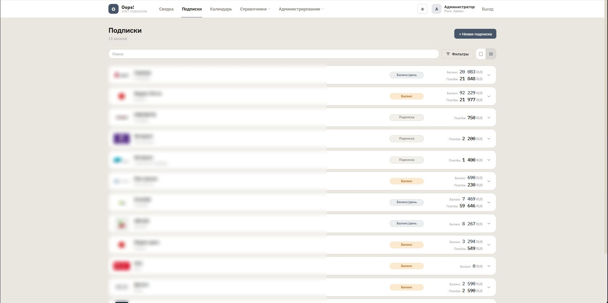

<div align="center">

# 💸 Oops!

### Учёт подписок и платежей для организаций

Самохостящееся веб-приложение для контроля подписок, регулярных и разовых платежей.
Один контейнер, SQLite внутри — никаких внешних баз настраивать не нужно.


</div>

---

## 📸 Скриншоты

<div align="center">

| Сводка (дашборд) | Список подписок |
|:---:|:---:|
|  |  |

</div>

---

## ✨ Возможности

- **Несколько организаций** (юр.лиц) — расходы по каждой отдельно
- **Контрагенты** (поставщики услуг) с логотипами:
  - Загрузка файла (PNG/SVG/WebP)
  - Авто-favicon с сайта
  - Поиск контрагента с созданием на лету
- **Сотрудники** (ответственные за подписки)
- **3 типа подписок**:
  - **Подписка** — регулярная оплата в указанный день месяца
  - **Счёт/Баланс** — пополняемый счёт, баланс можно получать из внешнего API
  - **Разовый платёж** — единичная оплата
- **Уведомления — 4 канала**:
  - Webhook (произвольный URL)
  - E-mail через SMTP
  - Telegram (Bot Token + Chat ID)
  - Bitrix24 (входящий вебхук)
  - Журнал доставки с историей попыток
- **Гибкие напоминания о платеже**:
  - Настройка «начать напоминать за N дней» — для каждой подписки
  - Ежедневные напоминания до оплаты, включая просрочку — пока не нажата кнопка «Продлено»
  - Флаг «Продлевается автоматически»: только предупреждение заранее, без напоминаний о просрочке
  - Алерт при низком балансе (для счетов)
- **Получение баланса из внешних API** — SMS.ru, BILLmanager (FirstVDS / FirstDedic) и др.
- **Категории и способы оплаты** с иконками
- **Автоматизация**:
  - Списание баланса в день списания
  - Получение балансов из внешних API (каждые 30 мин)
  - Авто-бэкап БД раз в неделю
- **Импорт/экспорт**:
  - Полный ZIP-бэкап (БД + логотипы + JSON)
  - Восстановление из бэкапа через интерфейс
  - Импорт из бэкапа Wallos
- **Два режима отображения**: крупные карточки и компактный список с раскрытием
- **Роли**: admin / manager / viewer
- **Темы**: тёмная и светлая
- **Обновление через UI** — загрузка нового `.tar.gz` без SSH (с авто-бэкапом БД)
- **HTTPS из коробки** — через встроенный Caddy (Let's Encrypt)
- **Безопасность**: автогенерация секретного ключа, secure-куки, требование сменить дефолтный пароль
- **Полностью автономно** — Alpine.js и стили хостятся локально, работает без интернета

## Установка

### Требования
- Ubuntu / Linux сервер
- Docker + Docker Compose v2

### Установка Docker
```bash
sudo apt update && sudo apt install -y docker.io docker-compose-v2
sudo usermod -aG docker $USER
# Перелогиниться чтобы группа применилась
```

### Запуск

**Вариант 0 — быстрый старт из готового образа (рекомендуется).**
Не требует скачивания исходников и сборки — образ тянется из реестра автоматически.

```bash
# создаём папку и качаем готовый compose-файл
mkdir oops && cd oops
curl -o docker-compose.yml https://raw.githubusercontent.com/vyalu/Oops/main/docker-compose.prod.yml
docker compose up -d
```

Готово — приложение доступно на `http://IP-сервера:8383` (логин/пароль по умолчанию `admin` / `admin`, смените после входа).

Обновление до новой версии:
```bash
docker compose pull && docker compose up -d
```

> Данные (`./data`) при обновлении сохраняются — образ обновляется, база остаётся.

**Вариант 1 — из Git (для разработки / правки кода):**
```bash
git clone https://github.com/vyalu/Oops.git
cd Oops
docker compose up -d --build
```

**Вариант 2 — из архива:**
```bash
tar -xzf oops.tar.gz
cd oops
docker compose up -d --build
```

Приложение работает за reverse-proxy **Caddy**, который автоматически получает HTTPS-сертификат.

**Перед запуском настройте домен в файле `Caddyfile`:**
- По умолчанию указан `oops.example.com` — замените на свой домен.
- Домен должен указывать (A-запись) на IP сервера, порты **80 и 443** проброшены из интернета. Тогда Caddy сам получит бесплатный сертификат Let's Encrypt — в браузере будет зелёный замок без предупреждений.
- Если домен только внутри сети (не виден из интернета) — в `Caddyfile` есть закомментированный вариант с `tls internal` (самоподписанный сертификат).

Открыть в браузере: `https://oops.example.com`

Логин по умолчанию: **`admin`** / **`admin`**. При первом входе вверху появится предупреждение с кнопкой смены пароля — **смените обязательно**.

### Безопасность
- **SECRET_KEY** (которым подписываются сессии) генерируется автоматически при первом запуске и сохраняется в `data/secret.key`. Можно задать свой через переменную окружения в `docker-compose.yml`.
- **HTTPS** обеспечивает Caddy; куки сессии помечены `secure` (`COOKIE_SECURE=1`).
- Файл `data/` (база, ключ, бэкапы) не попадает в Docker-образ (`.dockerignore`).

## Команды

| Действие | Команда |
|---|---|
| Запуск | `docker compose up -d` |
| Остановка | `docker compose down` |
| Логи приложения | `docker compose logs -f oops` |
| Логи Caddy (HTTPS) | `docker compose logs -f caddy` |
| Перезапуск | `docker compose restart` |
| Пересборка после правки кода | `docker compose up -d --build` |

## Обновление

### Вариант 1: через UI (рекомендуется)
1. Зайти как `admin`
2. Открыть вкладку **«Система»**
3. Перетащить новый `.tar.gz` архив в зону загрузки
4. Дождаться перезапуска (10-15 сек), обновить страницу (Ctrl+F5)

### Вариант 2: через консоль
```bash
cd ~ && rm -rf oops
tar -xzf oops.tar.gz
cd oops
docker compose up -d --build
```

При любом из вариантов **данные сохраняются** (БД и uploads в `data/`).

## Где хранятся данные

Всё в папке `./data/` рядом с `docker-compose.yml`:
- `oops.db` — база данных SQLite
- `uploads/` — загруженные документы
- `app_backup/` — бэкап предыдущей версии (создаётся при обновлении через UI)

Для **бэкапа** достаточно скопировать папку `data/`.

## Настройка

В `docker-compose.yml`:
- **Порт**: измените `8383:8000` на свой (первое число — внешний порт)
- **Часовой пояс**: переменная `TZ` (по умолчанию `Europe/Moscow`)
- **`SECRET_KEY`** для JWT — **обязательно** замените в продакшене на длинную случайную строку

### Как сменить порт

Приложение внутри контейнера всегда слушает порт `8000`. Наружу его выводит Docker — за это отвечает левое число в строке `ports`. Чтобы открывать сайт на другом порту, отредактируйте `docker-compose.yml`:

```yaml
ports:
  - "8383:8000"    # сайт доступен на http://IP-сервера:8383
```

Примеры:
- `"80:8000"` — открывать без порта: `http://IP-сервера`
- `"9000:8000"` — на порту 9000: `http://IP-сервера:9000`

После изменения примените:

```bash
docker compose down && docker compose up -d
```

> **Важно про порт 80.** Если порт 80 уже занят другим сервисом (например, системным веб-сервером Nginx или Caddy), контейнер не запустится с ошибкой `address already in use`. Сначала освободите порт 80 (остановите занявший его сервис) или выберите другой порт.

### Как открывать по доменному имени

Например, чтобы вместо `http://192.168.99.93` сайт открывался как `http://oops.loc.example.ru`. Само приложение уже принимает запросы по любому имени — нужно лишь направить имя на сервер. Два способа:

**Способ 1 — через локальный DNS-сервер** (если он есть в вашей сети). Добавьте A-запись, указывающую имя на IP сервера:

```
oops.loc.example.ru.  →  192.168.99.93
```

**Способ 2 — через файл hosts** (на каждом компьютере, где нужен доступ). Пропишите строку:

```
192.168.99.93   oops.loc.example.ru
```

- Windows: `C:\Windows\System32\drivers\etc\hosts` (открыть Блокнотом от администратора)
- Linux / macOS: `/etc/hosts` (редактировать через `sudo`)

После этого сайт откроется по имени. Если приложение работает на порту 80 — просто `http://oops.loc.example.ru`, если на другом порту — с указанием порта, например `http://oops.loc.example.ru:8383`.

> Чтобы получить красивый адрес без порта (`http://oops.loc.example.ru`), выведите приложение на порт 80 — см. раздел «Как сменить порт» выше.

## Роли

- **admin** — полный доступ: пользователи, webhooks, дизайн, обновление системы
- **manager** — создание/редактирование подписок и справочников
- **viewer** — только просмотр

## Webhook шаблон

В `payload_template` можно использовать:
- `{{subscription_name}}`, `{{subscription_price}}`, `{{subscription_currency}}`
- `{{subscription_category}}`, `{{subscription_date}}`, `{{subscription_organization}}`
- `{{subscription_url}}`, `{{subscription_notes}}`

Пример:
```json
{
  "name": "{{subscription_name}}",
  "price": "{{subscription_price}}",
  "date": "{{subscription_date}}",
  "org": "{{subscription_organization}}"
}
```

## Автоматические задачи

Внутри приложения работает APScheduler:
- **00:05** ежедневно — списание балансов (если сегодня день списания, для счетов без API)
- **Каждые 30 минут** — обновление балансов из внешних API (если указан `balance_api_url`)
- **Каждый час** — проверка и отправка напоминаний о платежах (с догоном пропущенного после перезапуска)
- **Воскресенье 03:00** — авто-бэкап БД

## API документация

После запуска доступна по адресу: `https://ВАШ_ДОМЕН/docs`

## Документация

- [CHANGELOG.md](./CHANGELOG.md) — история изменений
- [ARCHITECTURE.md](./ARCHITECTURE.md) — структура проекта и архитектура

## Лицензия

Распространяется под лицензией MIT — см. файл [LICENSE](./LICENSE).
