<p align="center">
  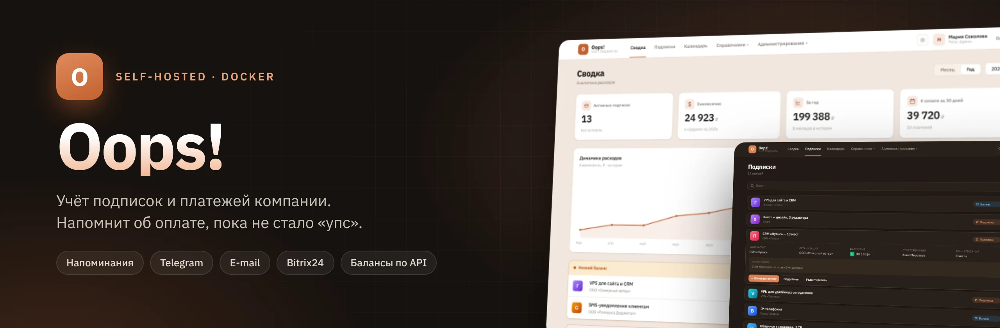
</p>

<p align="center">
  
  
  
  
  
  
</p>

<p align="center">
  <b>Самохостящийся сервис для учёта подписок, счетов и регулярных платежей организации.</b><br>
  Хостинг, домены, CRM, связь, облака — всё в одном месте: сколько стоит, когда платить, кто отвечает.<br>
  Напомнит в Telegram, на почту или в Bitrix24 — пока не стало «упс».
</p>

<p align="center">
  <a href="#-быстрый-старт"></a>
  &nbsp;
  <a href="../../releases/latest"></a>
</p>

<p align="center">
  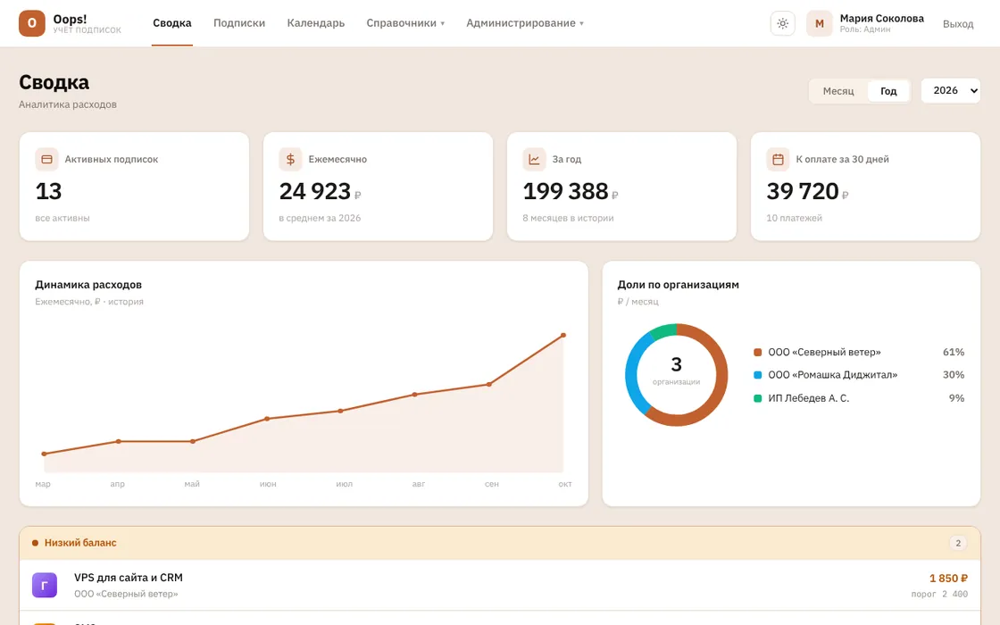
</p>

---

## ✨ Что умеет

<table>
<tr>
<td width="50%" valign="top">

### 💳 Все платежи компании в одном месте
- **Подписки** с оплатой раз в месяц, квартал или год
- **Счета с балансом** — хостинг, SMS, телефония: с периодическим или **ежедневным** списанием
- **Разовые платежи** — перенос сайта, покупка лицензии
- Несколько **организаций** (юр. лиц), **контрагенты** с логотипами, **ответственные** сотрудники
- Категории и способы оплаты с готовыми иконками

</td>
<td width="50%" valign="top">

### 🔔 Напомнит вовремя
- Предупреждает за N дней до платежа — для каждой подписки отдельно
- Ручная оплата: напоминает **каждый день, включая просрочку**, пока не нажмёте «Отметить оплату»
- Автопродление: только предупреждение заранее, без лишнего шума
- Тревога, когда **баланса не хватит** на следующее списание или осталось на N дней
- Каналы: **Telegram, E-mail, Bitrix24** и любой **webhook**, журнал доставки

</td>
</tr>
<tr>
<td valign="top">

### 📊 Видно, куда уходят деньги
- Сводка: расход в месяц и в год, сумма к оплате за 30 дней
- График динамики расходов и доли по организациям
- **Календарь платежей** с отметкой оплаченных
- Блоки «Низкий баланс» и «Просроченные платежи» прямо на главной

</td>
<td valign="top">

### 🔌 Балансы подтягиваются сами
- Получение баланса по **API** каждые 30 минут — SMS.ru, BILLmanager (FirstVDS, FirstDedic) и другие JSON/текстовые ответы
- Автосписание для счетов без API в день списания
- Ключи API скрыты от пользователей с ролью «Наблюдатель»

</td>
</tr>
<tr>
<td valign="top">

### 🛡 Ваши данные — у вас
- Один контейнер, SQLite внутри — никаких внешних баз
- Роли: администратор, менеджер, наблюдатель
- Защита от подбора пароля, httpOnly-сессии, запуск не от root
- Еженедельный авто-бэкап и копия базы перед каждым обновлением

</td>
<td valign="top">

### 🎨 Приятно пользоваться
- Светлая и тёмная тема, **8 цветов** оформления, режим «Компактно»
- Крупные карточки или компактный список с раскрытием
- Работает на телефоне
- Обновление новой версии **прямо из браузера** — загрузкой архива
- Импорт из **Wallos**, полный экспорт в ZIP

</td>
</tr>
</table>

## 🖥 Как это выглядит

| Сводка | Подписки | Календарь |
|:---:|:---:|:---:|
| 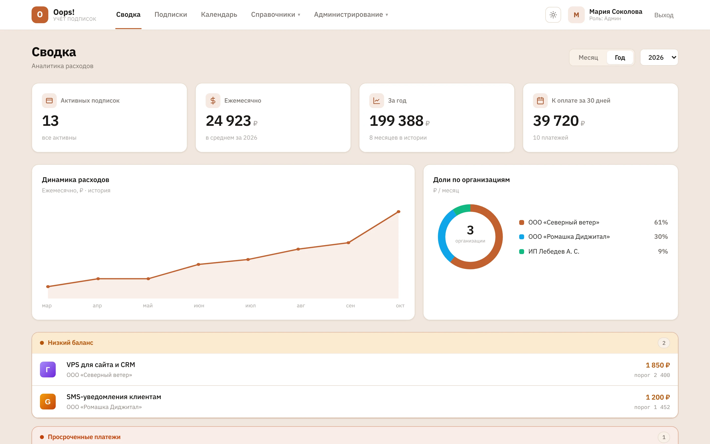 | 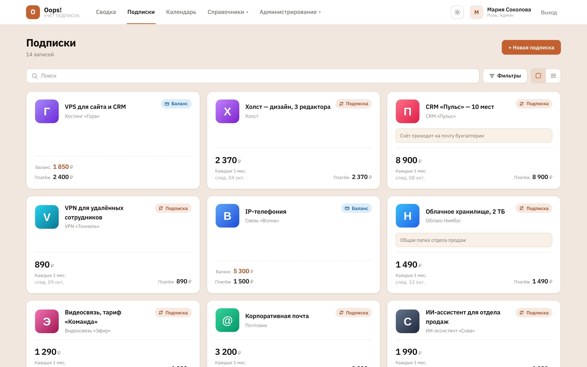 | 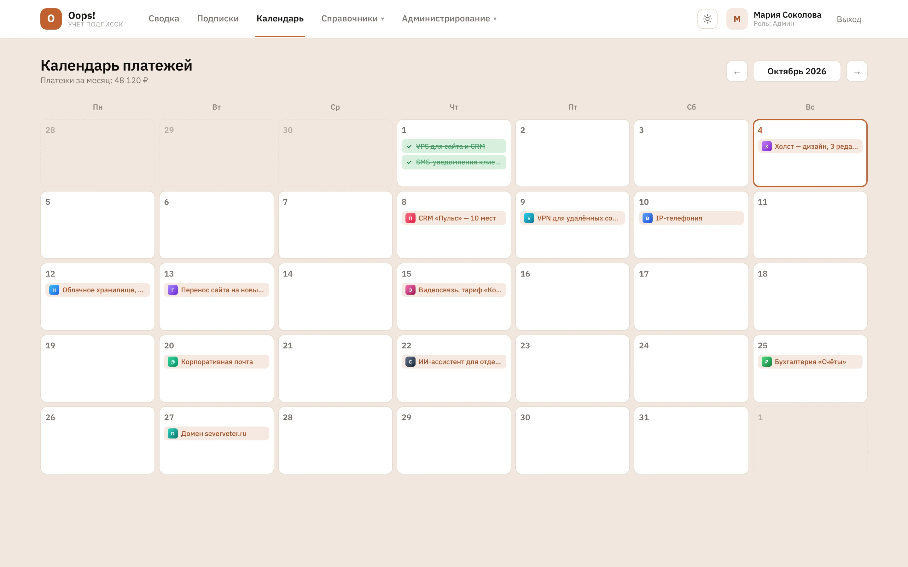 |
| Расходы, динамика, низкий баланс и просрочка | Карточки с суммой, периодом и датой следующего платежа | Все платежи месяца, оплаченные зачёркнуты |

## 📸 Скриншоты

<table>
<tr>
<td width="50%">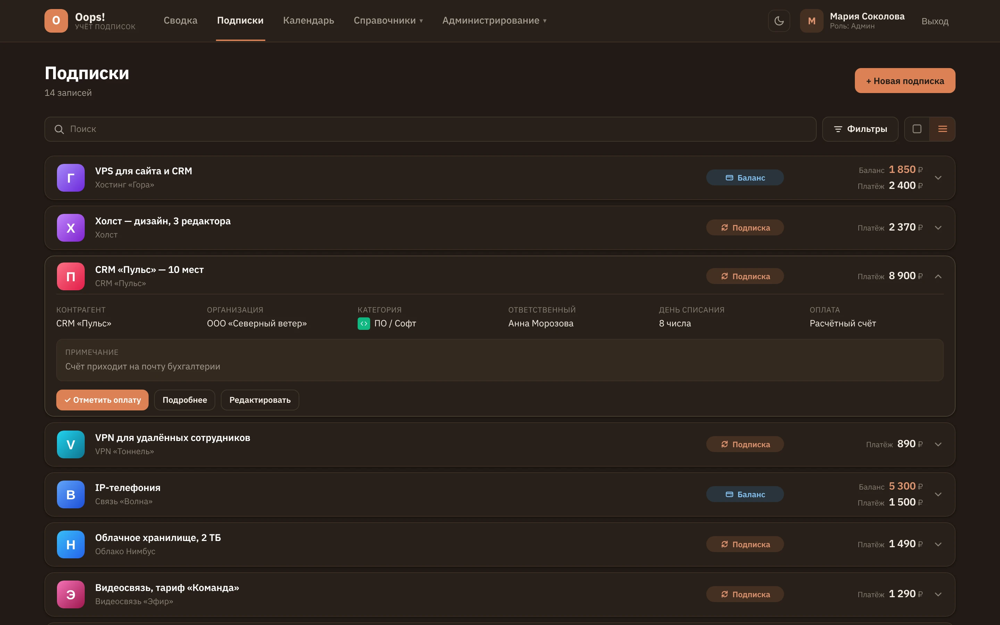<p align="center"><sub><b>Компактный список</b> — подробности раскрываются по клику</sub></p></td>
<td width="50%">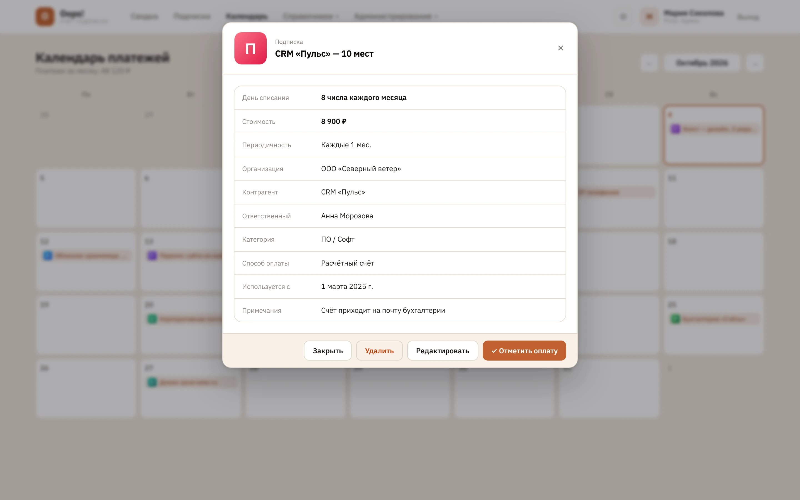<p align="center"><sub><b>Карточка подписки</b> — всё о платеже и кнопка «Отметить оплату»</sub></p></td>
</tr>
<tr>
<td>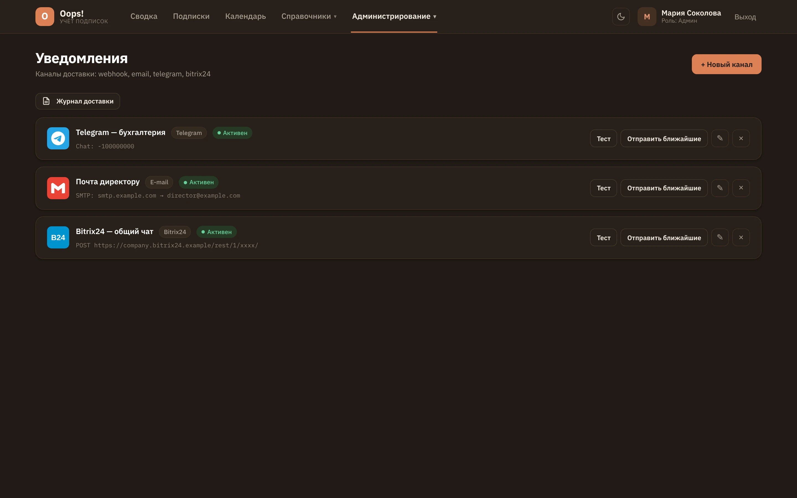<p align="center"><sub><b>Каналы уведомлений</b> — Telegram, почта, Bitrix24, webhook</sub></p></td>
<td>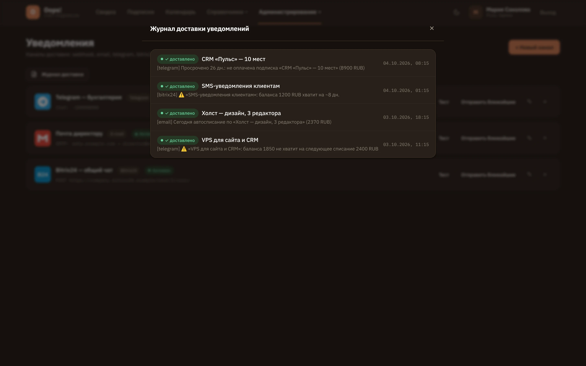<p align="center"><sub><b>Журнал доставки</b> — что, кому и когда ушло</sub></p></td>
</tr>
<tr>
<td>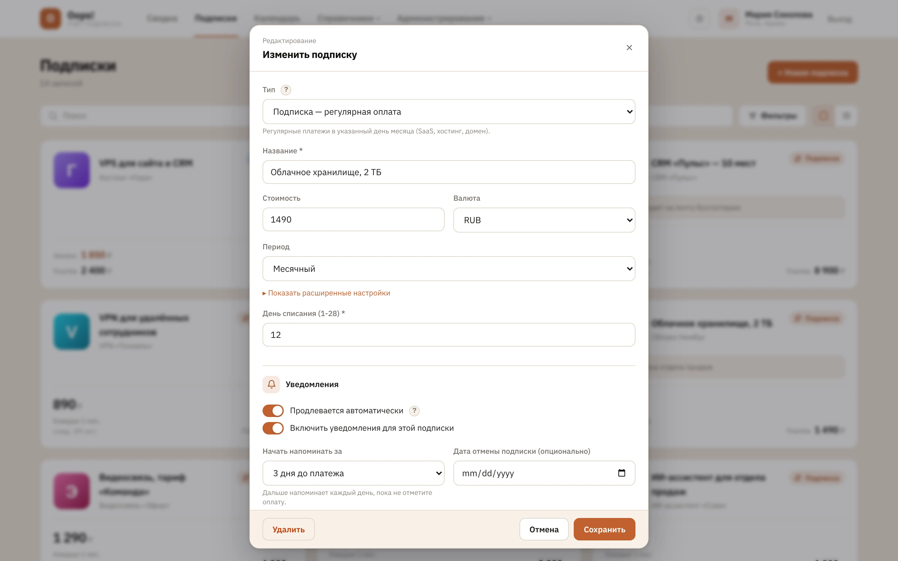<p align="center"><sub><b>Форма подписки</b> — с подсказками к каждому полю</sub></p></td>
<td>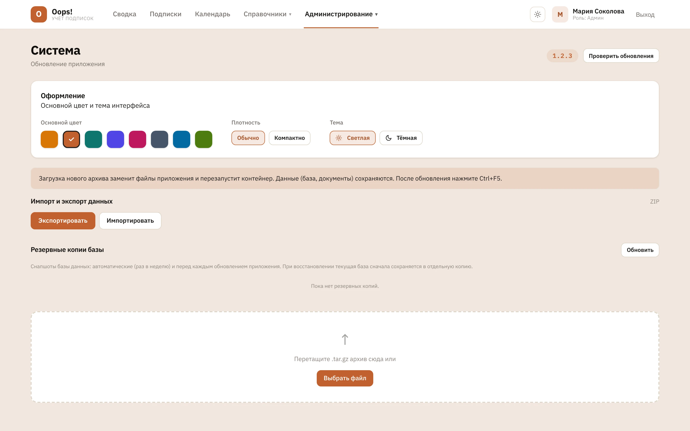<p align="center"><sub><b>Система</b> — оформление, бэкапы, обновление из браузера</sub></p></td>
</tr>
</table>

<details>
<summary><b>🎨 Цвета и темы</b></summary>
<br>

| | |
|:---:|:---:|
| 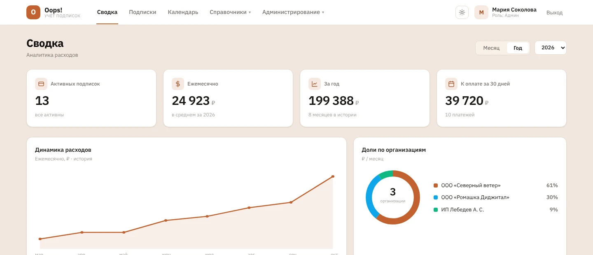 | 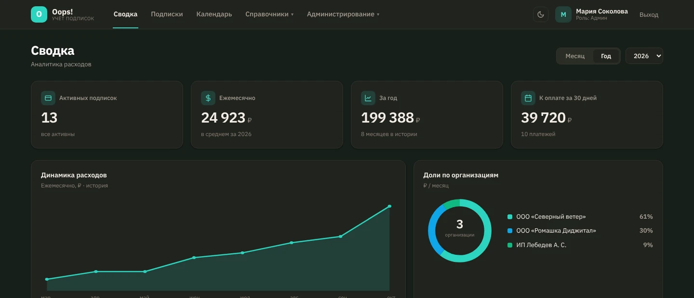 |
| 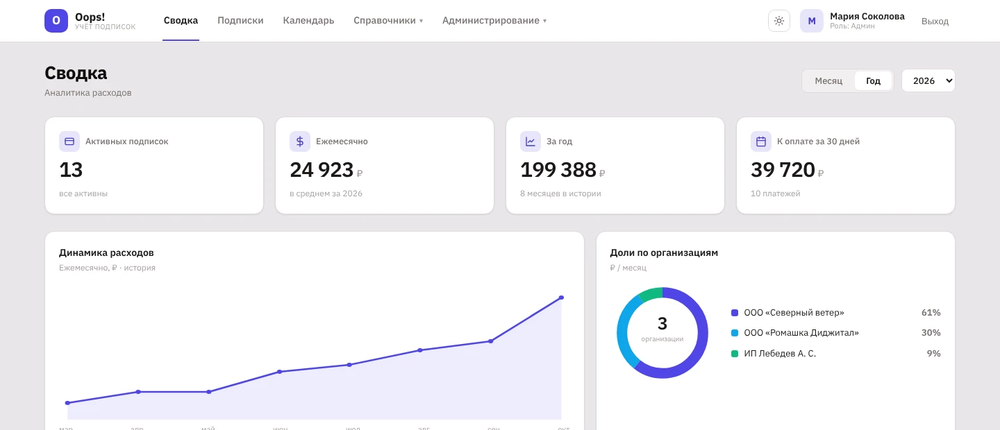 | 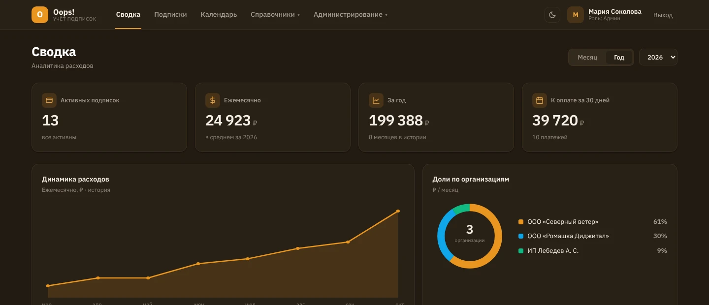 |

</details>

<details>
<summary><b>📱 На телефоне</b></summary>
<br>

<p align="center">
  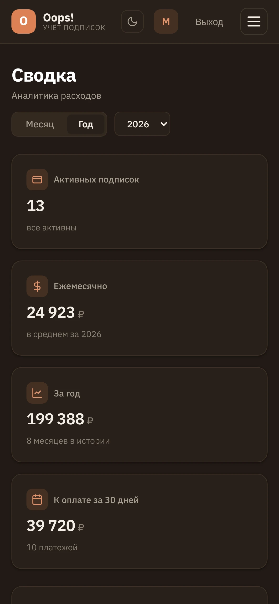
  &nbsp;
  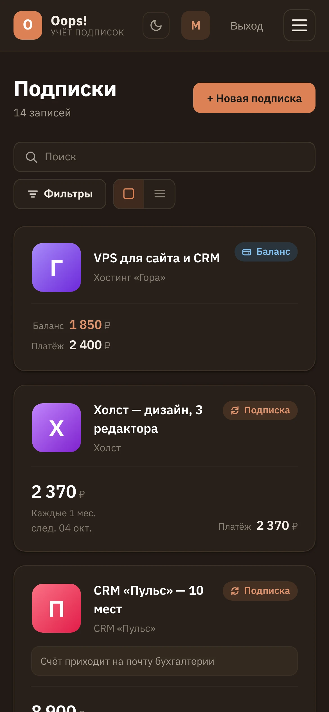
  &nbsp;
  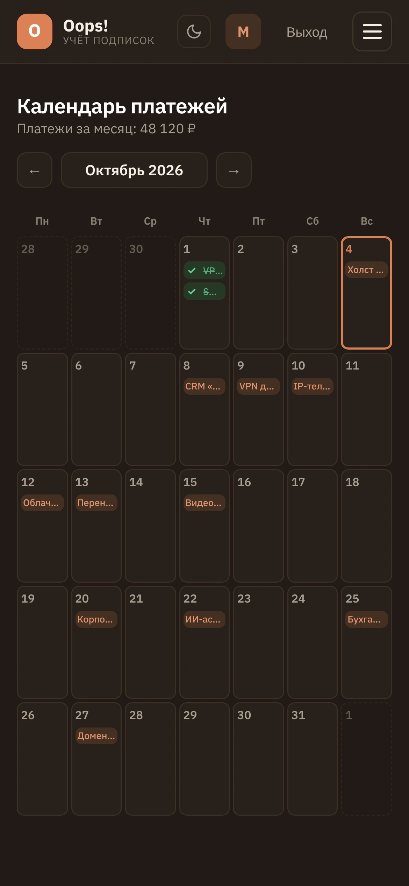
</p>

</details>

<sub>На скриншотах — выдуманная демо-база: организации, сервисы, люди и логотипы придуманы специально для этой страницы.</sub>

## 🚀 Быстрый старт

Нужен сервер с **Docker** и **Docker Compose v2** (Ubuntu 22.04 / 24.04 или любой Linux).

```bash
mkdir oops && cd oops
curl -o docker-compose.yml https://raw.githubusercontent.com/vyalu/Oops/main/docker-compose.prod.yml
docker compose up -d
```

Откройте `http://IP-сервера:8383` и войдите как **`admin` / `admin`**. Сразу после входа приложение попросит сменить пароль — смените.

> 💡 Все данные — база, логотипы, документы, бэкапы — лежат в папке `./data` рядом с `docker-compose.yml`. Для бэкапа достаточно скопировать её.

<details>
<summary><b>Docker ещё не установлен</b></summary>

```bash
sudo apt update && sudo apt install -y docker.io docker-compose-v2
sudo usermod -aG docker $USER
# перелогиньтесь, чтобы группа применилась
```
</details>

<details>
<summary><b>Другие способы установки: из исходников, из архива, с HTTPS</b></summary>

**Из Git** (для разработки и правки кода):
```bash
git clone https://github.com/vyalu/Oops.git
cd Oops
docker compose up -d --build
```

**Из архива** `oops.tar.gz`:
```bash
tar -xzf oops.tar.gz
cd oops
docker compose up -d --build
```

**С HTTPS и доменом** — через Caddy и бесплатный сертификат Let's Encrypt:
1. В файле `Caddyfile` замените `oops.example.com` на свой домен.
2. Домен должен указывать (A-запись) на IP сервера, порты **80 и 443** открыты из интернета. Для домена только внутри сети в `Caddyfile` есть вариант с `tls internal`.
3. Запустите:
```bash
docker compose -f docker-compose.https.yml up -d --build
```
</details>

## 🔄 Обновление

| Как установлено | Как обновить |
|---|---|
| Из готового образа | `docker compose pull && docker compose up -d` |
| Из архива или Git | **Система → перетащить `oops.tar.gz`** в зону обновления — база сохранится, перед обновлением сделается её копия. Затем Ctrl+F5 |
| Из архива, через консоль | см. ниже |

```bash
cd ~/oops && docker compose down && \
tar -xzf ~/oops.tar.gz --strip-components=1 -C ~/oops --exclude='oops/data' --exclude='oops/docker-compose.yml' && \
docker compose up -d --build
```

> Обновление из браузера заменяет только код приложения. Новые библиотеки и изменения `Dockerfile` применяются после пересборки командой выше.

## ⚙️ Настройка

<details>
<summary><b>Порт, часовой пояс и переменные окружения</b></summary>

Настраивается в `docker-compose.yml`:

| Переменная / параметр | Что делает | По умолчанию |
|---|---|---|
| `ports: "8383:8000"` | Внешний порт — левое число | `8383` |
| `TZ` | Часовой пояс напоминаний и списаний | `Europe/Moscow` |
| `SECRET_KEY` | Ключ подписи сессий | генерируется и хранится в `data/secret.key` |
| `COOKIE_SECURE` | `1` — куки только по HTTPS | выключено (включено в варианте с HTTPS) |
| `OOPS_MAX_UPLOAD_MB` | Максимальный размер документа | `50` |
| `OOPS_RUN_AS_ROOT` | `1` — запускать от root, как раньше | приложение работает от uid 1000 |

Пример: `"80:8000"` — открывать без порта, `http://IP-сервера`. После изменения: `docker compose down && docker compose up -d`.

> Если порт 80 занят (например, Nginx), контейнер не запустится с ошибкой `address already in use` — освободите порт или выберите другой.
</details>

<details>
<summary><b>Открывать по имени, например <code>http://oops.company.local</code></b></summary>

Направьте имя на IP сервера одним из способов:

- **Локальный DNS** — A-запись `oops.company.local → 192.168.1.10`
- **Файл hosts** на каждом компьютере — строка `192.168.1.10   oops.company.local`
  - Windows: `C:\Windows\System32\drivers\etc\hosts` (Блокнот от администратора)
  - Linux / macOS: `/etc/hosts` (через `sudo`)

Чтобы адрес был без порта, выведите приложение на порт 80.
</details>

<details>
<summary><b>Шаблон webhook</b></summary>

В `payload_template` доступны переменные:
`{{subscription_name}}`, `{{subscription_price}}`, `{{subscription_currency}}`, `{{subscription_category}}`, `{{subscription_date}}`, `{{subscription_organization}}`, `{{subscription_url}}`, `{{subscription_notes}}`, `{{message}}`, `{{event_type}}`.

```json
{
  "name": "{{subscription_name}}",
  "price": "{{subscription_price}}",
  "date": "{{subscription_date}}",
  "org": "{{subscription_organization}}",
  "message": "{{message}}"
}
```

`{{subscription_date}}` — дата платежа, о котором уведомление. Если шаблон — JSON, значения экранируются автоматически: кавычки в названиях не ломают запрос.
</details>

<details>
<summary><b>Роли пользователей</b></summary>

| Роль | Что может |
|---|---|
| **Администратор** | Всё: пользователи, каналы уведомлений, оформление, бэкапы, обновление |
| **Менеджер** | Создавать и редактировать подписки и справочники, отмечать оплату |
| **Наблюдатель** | Только просмотр. Не видит ключи API балансов и настройки каналов |
</details>

<details>
<summary><b>Фоновые задачи</b></summary>

| Когда | Что делает |
|---|---|
| Каждый час и при запуске | Напоминания о платежах — не чаще одного в сутки на подписку |
| Каждые 30 минут | Обновление балансов из внешних API |
| 00:05 ежедневно | Списание по счетам без API в день списания; пропущенное из-за выключенного сервера — догоняется |
| 1-го числа | Снимок месячного расхода для графика динамики |
| Воскресенье, 03:00 | Авто-бэкап базы (хранятся 4 последних) |
</details>

## 🧰 Полезные команды

| Действие | Команда |
|---|---|
| Запуск | `docker compose up -d` |
| Остановка | `docker compose down` |
| Логи | `docker compose logs -f oops` |
| Перезапуск | `docker compose restart` |
| Пересборка после правки кода | `docker compose up -d --build` |
| API-документация | `http://IP-сервера:8383/docs` |

<details>
<summary><b>Как устроен проект</b></summary>

```
app/
├── main.py           — запуск, миграции базы, заголовки безопасности
├── billing.py        — расчёт дат платежей, просрочки и низкого баланса
├── scheduler.py      — фоновые задачи и отправка уведомлений
├── auth.py           — вход, сессии, роли
├── routers/          — API по разделам: подписки, справочники, уведомления, система
└── static/           — интерфейс: index.html, app.js (Alpine.js), styles.css
docs/                 — картинки для этой страницы
docker-compose.yml        — запуск в локальной сети (порт 8383)
docker-compose.https.yml  — вариант с HTTPS через Caddy
docker-compose.prod.yml   — запуск из готового образа
```

Подробнее — в [ARCHITECTURE.md](./ARCHITECTURE.md), история изменений — в [CHANGELOG.md](./CHANGELOG.md).
</details>

## 🙏 Благодарности

- [FastAPI](https://fastapi.tiangolo.com/), [SQLAlchemy](https://www.sqlalchemy.org/), [APScheduler](https://apscheduler.readthedocs.io/) — серверная часть
- [Alpine.js](https://alpinejs.dev/) — интерфейс без сборки
- Шрифт [IBM Plex](https://www.ibm.com/plex/) (SIL OFL 1.1)
- Идея импорта — [Wallos](https://github.com/ellite/Wallos)

Распространяется под лицензией [MIT](./LICENSE).

<p align="center"><sub>Сделано с ❤️ для тех, кто хоть раз узнал о неоплаченном хостинге от упавшего сайта</sub></p>
